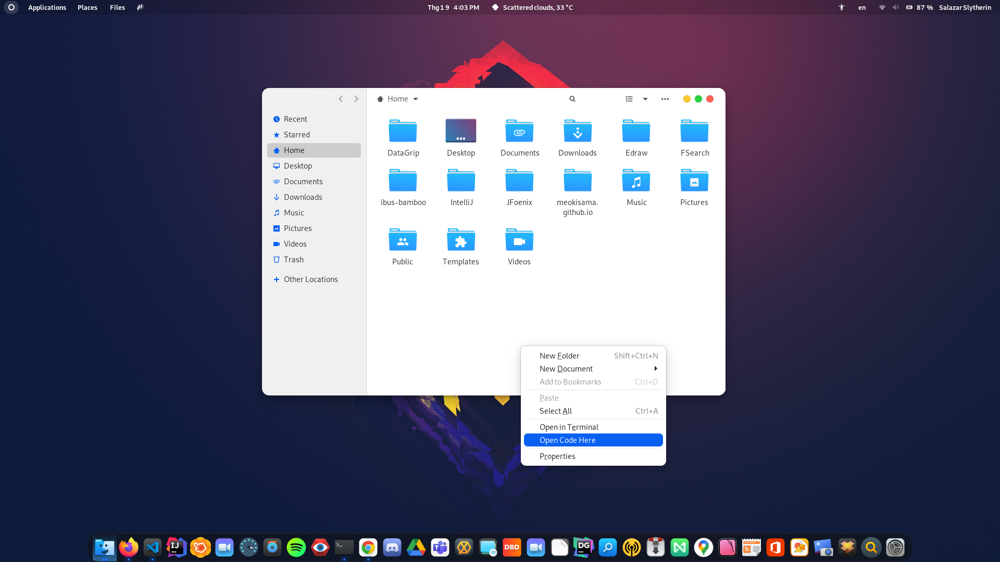

<p align="center">
  <a href="https://meokisama.github.io">
    
  </a>
</p>

<h1 align="center"> VSCode Context Menu For Nautilus </h1>


<p align="center">
  <a href="https://github.com/meokisama/meokisama.github.io/blob/develop/LICENSE">
    
  </a>
  
  <a href="https://twitter.com/intent/follow?screen_name=meokiiii">
    
  </a>
</p>

## About
A small repository provides a __Visual Studio Code__ extension to context menu for __Nautilus__.




## Instruction
### 1. Auto Installation
Copy and paste the following in your terminal :
```
wget -qO- https://raw.githubusercontent.com/meokisama/vscodemenu/master/install.sh | bash
```
### 2. Manual Installation
- You'll need to install ```python3-nautilus``` instead of ```python-nautilus``` because ```python-nautilus``` is not available in some OS's package repository anymore

      sudo apt install python3-nautilus
- Download file ```vscodemenu.py``` in my repo and place it in ```~/.local/share/nautilus-python/extensions``` :

      wget -q https://raw.githubusercontent.com/meokisama/vscodemenu/master/vscodemenu.py -P ~/.local/share/nautilus-python/extensions/
- Restart Nautilus and it done.

      nautilus -q && nautilus

### 3. Uninstall Extension
Copy and paste the following in your terminal :
```
rm -f ~/.local/share/nautilus-python/extensions/vscodemenu.py
```

## Find me around the web 🌎:
<a href="https://facebook.com/slytherinnn/"> </a>
- Information in public on <a href="https://meokisama.github.io/">__Blog__</a> ✍🏾
- Sharing updates on <a href="https://facebook.com/slytherinnn/">__Facebook__</a> 💼
- Other products on <a href="https://www.behance.net/meokisama">__Behance__</a> 🏓
- Daily photos on <a href="https://www.instagram.com/hi.im.meoki/">__Instagram__</a> 📷
- "Wibu" collection on <a href="https://www.flickr.com/photos/meokisama/albums">__Flickr__</a> 👾
